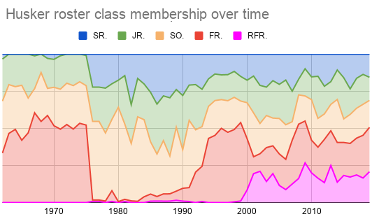

# Husker Scraper

## The problem!
_(We need data!!!)_  
Inspired by this twitter discussion:
https://twitter.com/_walkonU/status/1183929054589837312

> @_walkonU
>Bye week.  Open to any research project on the Huskers.  What do you want to know?

> @cuzcastjustin
> How about a chart with the total number of seniors, juniors, sophomores, and freshmen going back the last 30 years?

> @_walkonU
> Yeah. *That would take a lot longer than a week tho*.

> @cuzcastjustin
> I guess i was looking at a total number of players of each class on the roster each year. For instance, @Huskerpod tweeted out the number in each class this year. It was a lot of Fr and RFr, but i was more interested in how the numbers of upperclassmen stacked up to previous yrs

> @_walkonU
> Might be able to use media guide for this.  Does @HailVarsity already have this data?

> @cuzcastjustin
> I know it’s on Huskermax on the depth charts

> @_walkonU
> Just a matter of taking the time and getting what you want manually?

---

## Solution!

This project leverages `paquettg/php-html-parser` to scrape the data from the source suggested by my man @cuzcastjustin.
So I can do you one better than last 30 years and go back to 1962 when the data get's to funky to make exceptions.

* *Here's the 7k line scraped data:*
  [Full Table](sample-output/full-table.txt)
* *And the class (year) table:*
  [Class table](sample-output/class-table.txt)
  
## Results
> @Huskerpod tweeted out the number in each class this year. It was a lot of Fr and RFr, but i was more interested in how the numbers of upperclassmen stacked up to previous yrs

### Actual numbers for this year:
| Rfr | Fr | So | Jr | Sr |
| - | - | - | - | - |
| 32 | 46  │ 28  │ 24  │ 24 |

### Visual representation over the last 58 years:

### Full class data over last 58 years:

+------+-----+-----+-----+-----+------+-------+
| YEAR | FR. | SO. | JR. | SR. | RFR. | OTHER |
+------+-----+-----+-----+-----+------+-------+
| 2019 | 46  | 28  | 24  | 24  | 32   |       |
| 2018 | 40  | 29  | 28  | 19  | 23   |       |
| 2017 | 32  | 26  | 26  | 21  | 24   |       |
| 2016 | 29  | 25  | 22  | 30  | 22   |       |
| 2015 | 28  | 20  | 35  | 20  | 23   |       |
| 2014 | 35  | 38  | 26  | 14  | 18   |       |
| 2013 | 29  | 22  | 19  | 23  | 31   |       |
| 2012 | 39  | 23  | 25  | 29  | 18   |       |
| 2011 | 28  | 26  | 38  | 20  | 22   |       |
| 2010 | 33  | 41  | 23  | 23  | 30   |       |
| 2009 | 40  | 24  | 26  | 14  | 38   |       |
| 2008 | 52  | 28  | 15  | 24  | 23   | 1     |
| 2007 | 33  | 14  | 23  | 28  | 14   |       |
| 2006 | 21  | 24  | 31  | 18  | 9    |       |
| 2005 | 24  | 27  | 26  | 23  | 13   |       |
| 2004 | 23  | 23  | 31  | 22  | 24   | 1     |
| 2003 | 37  | 35  | 31  | 36  | 23   |       |
| 2002 | 18  | 31  | 39  | 32  | 32   |       |
| 2001 | 17  | 44  | 37  | 22  | 29   |       |
| 2000 | 57  | 40  | 25  | 29  | 14   |       |
| 1999 | 102 | 28  | 32  | 29  | 2    |       |
| 1998 | 92  | 41  | 33  | 22  | 1    |       |
| 1997 | 89  | 40  | 33  | 26  |      |       |
| 1996 | 93  | 36  | 31  | 26  |      |       |
| 1995 | 81  | 42  | 32  | 24  |      |       |
| 1994 | 70  | 35  | 30  | 27  |      |       |
| 1993 | 31  | 35  | 33  | 31  | 1    |       |
| 1992 | 31  | 43  | 46  | 31  |      |       |
| 1991 | 13  | 63  | 33  | 29  |      | 1     |
| 1990 | 9   | 27  | 38  | 29  |      | 1     |
| 1989 | 8   | 56  | 33  | 31  |      | 2     |
| 1988 | 5   | 26  | 40  | 30  |      | 1     |
| 1987 | 5   | 37  | 31  | 29  |      | 1     |
| 1986 | 3   | 28  | 33  | 33  |      | 1     |
| 1985 | 5   | 37  | 35  | 27  | 1    | 3     |
| 1984 | 6   | 80  | 37  | 31  |      |       |
| 1983 | 1   | 66  | 30  | 19  |      |       |
| 1982 | 1   | 34  | 23  | 30  |      |       |
| 1981 | 2   | 70  | 45  | 20  |      | 1     |
| 1980 | 1   | 94  | 27  | 26  |      |       |
| 1979 | 9   | 60  | 30  | 25  |      | 1     |
| 1978 | 1   | 44  | 29  | 22  |      |       |
| 1977 | 1   | 62  | 27  | 26  |      | 1     |
| 1976 | 1   | 62  | 27  | 26  |      | 1     |
| 1975 |     | 59  | 30  | 23  |      | 1     |
| 1974 |     | 63  | 33  | 22  |      |       |
| 1973 |     | 49  | 29  | 21  |      |       |
| 1972 |     | 51  | 27  | 19  |      |       |
| 1971 |     | 44  | 24  | 20  |      | 1     |
| 1970 |     | 44  | 22  | 16  |      | 3     |
| 1969 |     | 61  | 19  | 21  |      | 3     |
| 1968 |     | 53  | 32  | 12  |      |       |
| 1967 |     | 52  | 14  | 19  |      | 1     |
| 1966 |     | 46  | 23  | 29  |      |       |
| 1965 |     | 34  | 30  | 17  |      |       |
| 1964 |     | 36  | 21  | 16  |      |       |
| 1963 |     | 34  | 24  | 15  |      |       |
| 1962 |     | 20  | 21  | 17  |      | 2     |
+------+-----+-----+-----+-----+------+-------+

### Full data over last 58 years:

[data](sample-output/full-table.txt)